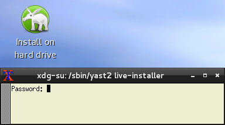
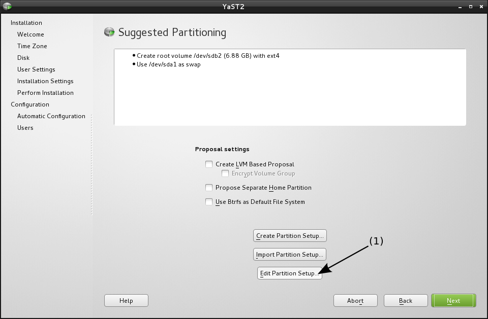
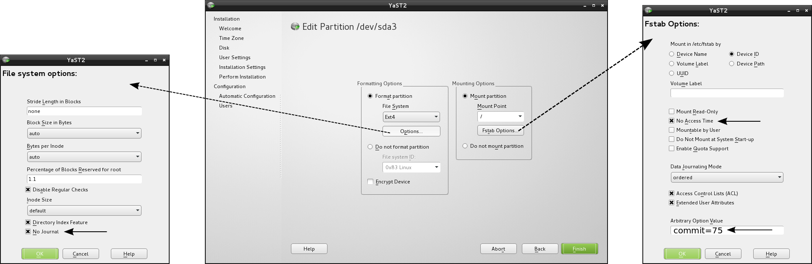

# Installation guide

## Introduction

This installation guide don't replace the [official installation guide](http://doc.opensuse.org/documentation/html/openSUSE/opensuse-startup/art.osuse.installquick.html), we only expose some additional configuration.

## Start the installation

On your desktop you should be able to see a unique icon named "Install on hard drive". When you click on it, this terminal window appears :

By default the root password is "linux". The options asked by the installer are well known, documented and straightforward so we won't explain them here.

## Partitioning

This is where you will do some modifications. Click on the "Edit Partition Setup" button. You should have a window like this :

> Note : You probably haven't as many partitions as I do on /dev/sda, this is perfectly normal.

**You will have to do the following manipulation for each partition (if you want multiple partitions).**

1. Select and edit a partition (2 and 3 of the picture above)
2. Edit the options for the file system and fstab :

> Explanation : By default the file system journal write every access, creation and modification of files. This cause to wake up the hard disk each thus it consumes more power.

Then you can continue the installation wizard as a regular OpenSUSE installation.
